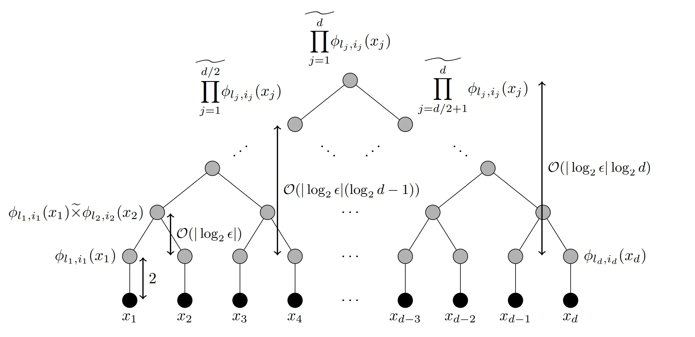

Sparse grids are a computational technique used to solve complex mathematical problems efficiently, particularly in high-dimensional spaces. Unlike traditional methods that require a dense grid covering the entire problem domain, sparse grids strategically place grid points only where they are most needed, significantly reducing computational effort. This approach leverages hierarchical structures to approximate functions accurately while minimizing the number of grid points needed. By focusing computational resources on essential areas, sparse grids allow for more efficient and scalable solutions, making them valuable tools in various fields, including finance, engineering, and machine learning.

My thesis explores approximating expectations of processes following stochastic differential equations (SDEs) using neural networks, building upon the results of "Multilevel Monte Carlo Learning (2022), Gerstner, Harrach et al." 

The goal is to investigate whether training a neural network with data generated using sparse-grid methods can reduce computational complexity compared to a Monte Carlo approach, particularly in derivative valuation scenarios. I wanto to outline a few convergence statements regarding sparse-grids, which relate to the convergence and architecture of neural networks.

## Motivation

The discretization of PDEs and quadrature on full product grids through conventional methods is often limited to up to 5 dimensions due to memory requirements and complexity. This limitation arises from what is known as the curse of dimensionality, where the costs of approximating a problem's solution with an accuracy ϵ exponentially depend on the dimensionality d of the problem. Complexity scales of the order $\mathcal{O}(\epsilon^{-\alpha d)})$ are obtained with α > 0, depending on the smoothness of the function to be approximated and the implementation. When considering uniform grids with piecewise d-polynomial functions in a bounded domain using finite elements, we obtain approximately O(N^d) grid points with approximation accuracy $\mathcal{O}(N^{-\alpha '}). \ \alpha '$ depends on the smoothness of the approximating function. Hence, computational costs grow exponentially with the dimension of the problem, necessitating compromises even on the fastest computers.

The curse of dimensionality can somewhat be mitigated when restricting ourselves to a class of functions. If we make the stronger assumption that the smoothness of the solution behaves such that the approximation quality depends negatively exponentially on d, i.e., $\mathcal{O}(N^{(-β/d)})$, we see that the cost-benefit ratio of the grid becomes independent of the dimension d, with $O(N^d \cdot N^{(-β/d)}) = O(N^{-β})$, where $β$ is independent of $d$. Through this somewhat unrealistic assumption, the curse of dimensionality can be completely broken. The Table below provides us with an idea of the magnitudes of RAM savings that can be achieved by sparse grids.

| points per axis vs RAM used | d = 3 | d = 4 | d = 5 | SG d = 48 |
|----------------|-------|-------|-------|----------|
| 50     | 25.0 MB | 1250 MB | 1250 MB | 0.018 GB, l = 1∗          |
| 90     | 262 MB | 2.9 GB | > 16 GB  | 0.92 GB, l = 2∗  |
| 100    | 400 MB | 4.0 GB  |           | 3.1 GB, l = 3∗   |
| 150    | 2 GB | 13.5 GB |           | 8.0 GB, l = 4∗   |
| 200    | 6.4 GB | > 16 GB |           |   |

<small>* Gauss-Patterson construction for 48 dimensional grid in single precision float32, ram usage is usually a bit higher during construction</small>

The basic idea behind thin grids was already seen in 1963 by the Russian mathematician Smolyak, where they were used for numerical integration. Since the 1990s, the application of thin grids has gained popularity, largely due to the results of the research group at the University of Bonn led by Michael Griebel.

The main idea for showing convergence for a class of ReLu neural networks is by approximating polynomials through a network structure. This is illustrated in the picture below.

